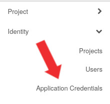

# IRefIndex VSC

This module contains the changes that were neccecary to run and build the irefindex on the VSC.

## A step by step usage guide

This guide will walk you through the process of provisioning a machine, downloading the irefindex, and running the irefindex on the VSC.

If you have already done this once on the host machine, you can skip to step [4](#4-provision-the-machine-using-terraform-irinit-and-irdownload).

### 1. Install terraform and ansible

This is the only step that is not accomodated by any image or command; as this will depend on your local machine.

You can find the installation guides here:

- [Terraform](https://learn.hashicorp.com/tutorials/terraform/install-cli)
- [Ansible](https://docs.ansible.com/ansible/latest/installation_guide/intro_installation.html)

### 2. Clone this repository and navigate to the terraform directory

```bash
git clone https://github.com/vibbits/irefindex.git
cd irefindex/vsc/terraform
```

### 3. Download your `clouds.yaml` file from the VSC platform

> If you are already signed in, you can skip to step 4 by clicking [here](https://cloud.vscentrum.be/dashboard/identity/application_credentials).

1. Go to the [VSC cloud platform](https://cloud.vscentrum.be) and sign in if you haven't already.

2. On the dashboard open the `Identity` navigation group:


3. The group will expand and show you items, of those items click on `Application Credentials`:



4. On the application credentials page we will need to create new credentials, click on the `Create Application Credential` button:


5. Fill in the form with your desired configuration, and click on the `Create Application Credential` button:


6. Your credentials will be shown, do not share these with anyone. Click on the `Download clouds.yaml` button to download your `clouds.yaml` file and place this in the `./terraform/` directory:


At this point your file structure should look like this:

```bash
└── vsc
    ├── README.md
    ├── ansible
    │   └── # ... (ansible files)
    └── terraform
        ├── clouds.yaml # <--- This file should be here
        ├── irefindex.auto.tfvars.example
        ├── main.tf
        └── variables.tf
```

### 4. Provision the machine using terraform, irinit and irdownload.

> Note: The actual provisioning of the machine will take a while, as it will have to download and build the irefindex. During this time your host machine must stay connected to the server.

1. Copy the `irefindex.auto.tfvars.example` file to `irefindex.auto.tfvars`:
    > Note: Additional variables can be found in the `variables.tf` file.
    ```bash
    # pwd: irefindex/vsc/terraform
    cp irefindex.auto.tfvars.example irefindex.auto.tfvars
    ```
2. Edit the `irefindex.auto.tfvars` file to your liking, you can find your available machine flavors in [Launch Instance > Flavor](https://cloud.vscentrum.be/dashboard/project/instances).
3. Download Terraform OpenStack provider plugin:
    ```bash
    # pwd: irefindex/vsc/terraform
    terraform init
    ```
4. Run terraform to provision the machine and run the `./ansible/main1.yml` playbook:
    > Note: When asked for confirmation, double check that you want to perform this action and type `yes`.
    > If you want to skip the confirmation step, you can add the `-auto-approve` flag to the command.
    ```bash
    # pwd: irefindex/vsc/terraform
    terraform apply
    ```

### 4.1. (Optional) Try to fix the problems of main1 automatically

Follow the aproach in [Adding/removing sources from runs](#addingremoving-sources-from-runs) to comment out all sources except the one you want to re-run.

Then run this  command to re-run the `irdownload` process for that source:

```bash
# pwd: irefindex/vsc
nsible-playbook -i '193.190.80.24,' --ssh-extra-args='-p 50022' -u 'debian' --private-key=~/.ssh/id_ed25519 ../ansible/after_main1.yml
```

### 5. Run irunpack, irmanifest and irparse

```bash
# pwd: irefindex/vsc
ansible-playbook -i '193.190.80.24,' --ssh-extra-args='-p 50022' -u 'debian' --private-key=~/.ssh/id_ed25519 ansible/main2.yml
```

### 6. Run irimport

```bash
# pwd: irefindex/vsc
ansible-playbook -i '193.190.80.24,' --ssh-extra-args='-p 50022' -u 'debian' --private-key=~/.ssh/id_ed25519 ansible/main3.yml
```

### 7. Destroy the machine

> IMPORTANT: This will destroy the machine and all data on it. Please make sure you have a exported the iRefIndex before running this.

```bash
# pwd: irefindex/vsc/terraform
terraform destroy
```

## Adding/removing sources from runs

All sources *(and other variables)* are located in the `./ansible/vars/` directory. The `sources.yml` file contains all the sources that will be used. The properties of that source can fully control the whole process of that source from start to finish.

This dynamic aproach also means that adding new sources can simply be done by adding a new line to the `sources.yml` file. And removing a source can be done by removing the line from the `sources.yml` file.

### Reccomended approach for handing issues that only affect certain sources

If you had issues with a certain source; have resolved the issue, and want to rerun the process for that source. You can simply comment out all other sources by adding a `#` before each source that shouldn't be used.

## Error handling

The playbooks provide a more advantagous way of starting the actions by running this in parralel. To prevent that a error for another resource would kill or corrupt another source its process; errors are collected and shown together when all sources have finished their process.

### SSH Error?

If you are receiving a invalid keys error from ssh, you can run the `./fix_ssh_key.sh` or `./fix_ssh_key.ps1` scripts for `linux` or `windows` respectivly.

## Debugging iRefIndex issues

All jobs are logged to the `/data/irdata18/logs/<datetime>/` directory. The `datetime` for that playbook will be printed in the terminal fail message if any errors occur.

The logging is separated for each process using directories. So if you want to debug the `irdownload` process, you can find the logs in the `/data/irdata18/logs/<datetime>/irdownload/` directory.

There can be up to three different filetypes for each item in the directory.

- `.out` file contains the stdout of the process
- `.err` file contains the stderr of the process
- `.msg` file contains any extra messages that have been sent to ansible

This allows quick and easy debugging of any issues that may occur.

## Known issues with sources

### IRDOWNLOAD

- BAR can not be downloaded, due to infrastructure issues on their side. The resource is still included in the `./ansible/vars/sources.yml` file but will result in an error.
- INNATEDB can not be downloaded, due to infrastructure issues on their side. The resource is still included in the `./ansible/vars/sources.yml` file but will result in an error.
- IPI can not be downloaded, due to infrastructure issues on their side. The resource is still included in the `./ansible/vars/sources.yml` file but will result in an error.
- CORUM can not be downloaded, due to infrastructure issues on their side. The resource is still included in the `./ansible/vars/sources.yml` file but will result in an error.

## FAQ

### What are all the things that Terraform provisions?

- A keypair (to be used to access the VM)
- A security group (to allow SSH access)
- A port (to attach the security group to)
- A volume (to store the data)
- A VM (to run the iRefIndex software)
- A port forwarding rule (to allow SSH access to the VM)
